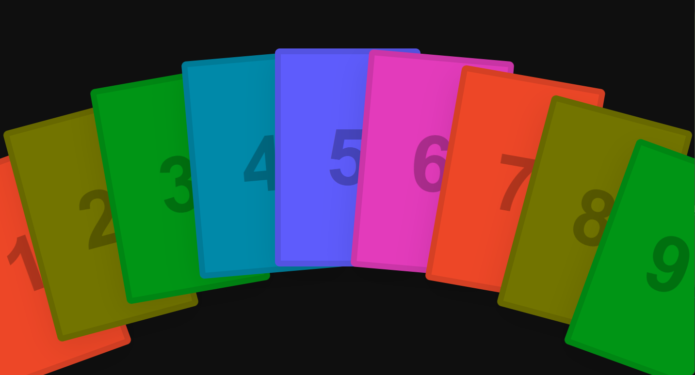
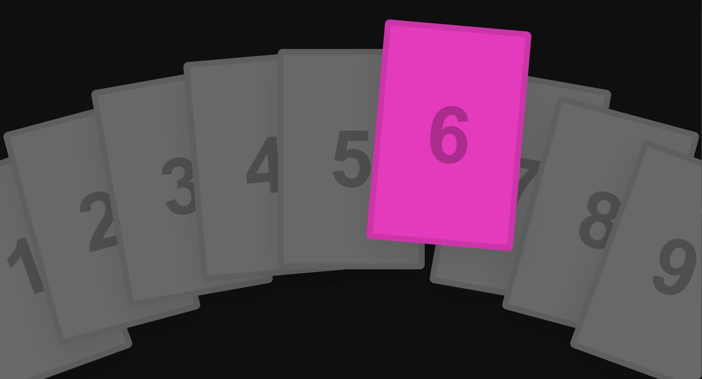

# Poker Hover Effect

[](https://github.com/cworld1/poker-hover-effect/commits)
[](https://github.com/cworld1/poker-hover-effect/stargazers)
[](https://github.com/cworld1/poker-hover-effect/blob/main/LICENSE)

扑克牌悬停特效

A demo HTML program that shows poker hover effect only using CSS.

## Screenshot





## Online demo

[Demo (Github)](https://cworld1.github.io/poker-hover-effect/)

## Local development

Clone the repository:

```shell
git clone https://github.com/cworld1/poker-hover-effect.git
```

Go into the folder, and open the HTML file using your favorite broswer.

## Contributions

To spend more time coding and less time fiddling with whitespace, this project uses code conventions and styles to encourage consistency. Code with a consistent style is easier (and less error-prone!) to review, maintain, and understand.

## License

This project is licensed under the GPL 3.0 License.
